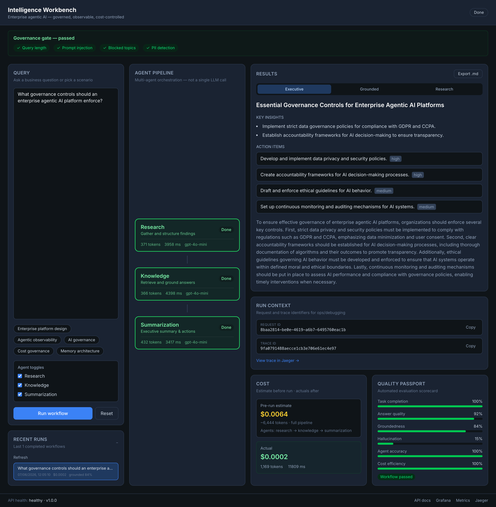

# AI Agent Platform

> Enterprise-grade agentic AI reference implementation — with a live **Intelligence Workbench** that shows how multi-agent systems are governed, observed, cost-controlled, and delivered to business users.

[](https://www.python.org/downloads/)
[](https://fastapi.tiangolo.com/)
[](https://langchain-ai.github.io/langgraph/)
[](workbench/)

**This is not a chatbot.** It is a reference platform and demo workbench for Principal Engineers, AI Platform Architects, and engineering leaders who need to show *why* governed multi-agent orchestration beats a single LLM call.

---

## What You Get

| Layer | What it demonstrates |
|-------|----------------------|
| **Intelligence Workbench** | Business-facing UI — query, live agent pipeline, executive output, cost, quality scorecard |
| **Agent platform** | Research → Knowledge → Summarization pipeline via LangGraph |
| **Governance** | Prompt injection, PII, blocked topics — visible before agents run |
| **Observability** | OpenTelemetry traces, Prometheus metrics, Grafana dashboards, Jaeger deep links |
| **Cost control** | Pre-run estimate vs actual cost per workflow |
| **Quality** | Automated evaluation scorecard (groundedness, hallucination, completion) |

---

## Intelligence Workbench

The workbench is the fastest way to understand what this platform delivers. It is an **operations console**, not a generic chat UI — every run surfaces governance, orchestration, cost, and quality alongside the business outcome.



A typical session shows:

1. **Governance gate** — query length, injection, PII, and blocked-topic checks before execution
2. **Live agent pipeline** — Research → Knowledge → Summarization with per-agent latency and tokens
3. **Executive deliverable** — headline, insights, and action items (not just a chat reply)
4. **Cost panel** — pre-run estimate vs actual spend (~$0.0002 for a full pipeline on gpt-4o-mini)
5. **Quality passport** — groundedness, hallucination rate, task completion, cost efficiency
6. **Run context** — copyable `request_id` and `trace_id` with links to Jaeger, Grafana, and metrics

```bash
# Terminal 1 — API
make dev

# Terminal 2 — Workbench
make workbench-install   # first time only
make workbench-dev

open http://localhost:5173
```

Or serve the built UI from the API:

```bash
make workbench-build
make dev
open http://localhost:8000
```

---

## Executive Summary

Organizations moving from prototype chatbots to production agentic AI need more than an LLM wrapper. They need **governed orchestration**, **observable execution**, **predictable cost**, and **measurable quality**.

This repository provides a working reference: three specialized agents coordinated by LangGraph, exposed through FastAPI, and demonstrated through the Intelligence Workbench. Mock mode runs without OpenAI; the full stack adds Qdrant, PostgreSQL, Prometheus, and Grafana.

---

## Business Problem

| Challenge | How this platform addresses it |
|-----------|----------------------------------|
| Unpredictable AI costs | Token budgets, model tiering, pre-run cost estimate, per-request actuals in the UI |
| No visibility into agent behavior | Live pipeline in the workbench; OTel traces; Prometheus + Grafana |
| Inconsistent output quality | Automated scorecard with groundedness and hallucination metrics |
| Security and compliance gaps | Governance gate on every request; audit logging; PII and injection checks |
| Architecture uncertainty | ADRs, tradeoff analysis, D2 diagrams, four-stage scalability model |
| Stakeholder communication | Workbench demo script — show cost, governance, and quality in one screen |

---

## Why Agentic AI (Not a Single LLM)

```
Single LLM:     User → [One Model] → Response
                (opaque, expensive, hard to govern)

Agentic AI:     User → [Governance] → [Router] → [Research] → [Knowledge] → [Summarization] → [Evaluation]
                (specialized agents, observable steps, cost-aware, quality-scored)
```

Specialized agents improve quality per task. Orchestration enables routing and retries. Governance and observability apply at every step — not after the fact.

---

## Architecture Overview


See also [system context](diagrams/system-context.svg) and [docs/architecture.md](docs/architecture.md) for deeper layer detail.

| Tier | Components |
|------|------------|
| Client | Intelligence Workbench (React + Vite) |
| API | FastAPI — REST, SSE streaming, run history, cost estimate |
| Governance | Injection / PII / topic guards on every request |
| Orchestration | LangGraph workflow, agent router, retry policy |
| Agents | Research, Knowledge, Summarization (gpt-4o-mini) |
| Memory | Qdrant (vectors) + PostgreSQL (metadata, audit) |
| Observability | OpenTelemetry → Jaeger / Prometheus → Grafana |

---

## Agent Design

Three agents, each with a single responsibility:

| Agent | Role | Output |
|-------|------|--------|
| **Research** | Gather and structure information | Findings, references, confidence |
| **Knowledge** | Retrieve and ground answers | Citations, retrieved chunks, confidence |
| **Summarization** | Synthesize for decision-makers | Executive summary, insights, action items |

See [docs/agent-design.md](docs/agent-design.md).

---

## Workflow

```
Query → Governance Gate → Agent Router → Research → Knowledge → Summarization → Evaluation → Response
```

| Capability | Implementation |
|------------|----------------|
| Live progress | SSE stream (`/workflow/execute/stream`) |
| Combined run | Single call with result + scorecard (`/workflow/run`) |
| Cost estimate | Pre-execution projection (`/workflow/estimate-cost`) |
| Run history | Last N completed runs (`/workflow/history`) |
| Retry handling | Exponential backoff, max 3 retries |

See [docs/workflow-orchestration.md](docs/workflow-orchestration.md).

---

## Quick Start

### Prerequisites

- Python 3.11+
- Node.js 18+ (for the workbench)
- Docker & Docker Compose (optional — full observability stack)
- OpenAI API key (optional — mock mode works without it)

### API only (mock mode)

```bash
git clone https://github.com/your-org/ai-agent-platform.git
cd ai-agent-platform

python -m venv .venv && source .venv/bin/activate
pip install -r requirements.txt
make dev
```

### Workbench + API (recommended demo)

```bash
make dev              # API on :8000
make workbench-dev    # UI on :5173
```

### Full stack (Docker)

```bash
cp .env.example .env
make docker-up
curl http://localhost:8000/api/v1/health
```

### API examples

```bash
# Run workflow + scorecard in one call
curl -X POST http://localhost:8000/api/v1/workflow/run \
  -H "Content-Type: application/json" \
  -d '{"query": "What governance controls should an enterprise agentic AI platform enforce?"}'

# Pre-run cost estimate
curl -X POST http://localhost:8000/api/v1/workflow/estimate-cost \
  -H "Content-Type: application/json" \
  -d '{"query": "Enterprise AI governance best practices"}'

# Recent runs
curl http://localhost:8000/api/v1/workflow/history?limit=10
```

OpenAPI docs: `http://localhost:8000/docs`

---

## Memory

| Tier | Store | Purpose |
|------|-------|---------|
| Short-term | LangGraph state | Conversation context, agent outputs per request |
| Vector | Qdrant | Semantic knowledge retrieval |
| Metadata | PostgreSQL | Sessions, workflows, audit logs, run history |
| Cache | Redis (Stage 2+) | Frequent query caching |

See [diagrams/memory-architecture.d2](diagrams/memory-architecture.d2).

---

## Observability

| Pillar | Technology | Tracked in workbench |
|--------|------------|----------------------|
| Traces | OpenTelemetry | `trace_id` + Jaeger link |
| Metrics | Prometheus | Footer link to `/api/v1/metrics` |
| Logs | structlog (JSON) | Governance and workflow events |
| Dashboards | Grafana | Footer link (local stack) |

```bash
curl http://localhost:8000/api/v1/metrics
open http://localhost:3000   # Grafana (Docker stack)
```

See [docs/monitoring-observability.md](docs/monitoring-observability.md).

---

## Cost Governance

| Strategy | Impact |
|----------|--------|
| Model tiering (gpt-4o-mini default) | ~90% cost reduction vs gpt-4o |
| Agent routing | Skip agents when not needed |
| Token budgeting | 8K per request (configurable) |
| Pre-run estimate | Shown in workbench before execution |

**Typical full pipeline cost:** ~$0.0002 (gpt-4o-mini, mock or live)

See [docs/cost-governance.md](docs/cost-governance.md).

---

## Evaluation

Every completed workflow produces a quality scorecard:

| Dimension | What it measures |
|-----------|------------------|
| Task completion | Output completeness |
| Groundedness | Citation and retrieval quality |
| Hallucination rate | Inverse confidence signal |
| Agent accuracy | Per-agent success rate |
| Cost efficiency | Quality per dollar |

See [docs/evaluation-framework.md](docs/evaluation-framework.md).

---

## AI Governance

- Prompt injection detection
- PII filtering (SSN, credit card)
- Blocked topic policies
- Token budget enforcement
- Audit logging on workflow events

Governance results are returned in the API and displayed in the workbench governance gate.

See [docs/security-governance.md](docs/security-governance.md).

---

## Deployment

| Model | Use case | Diagram |
|-------|----------|---------|
| Local Docker | Development, demos | [deployment-local.d2](diagrams/deployment-local.d2) |
| AWS ECS/Fargate | Production SaaS | [deployment-aws.d2](diagrams/deployment-aws.d2) |
| Kubernetes/EKS | Enterprise multi-tenant | [deployment-k8s.d2](diagrams/deployment-k8s.d2) |

See [docs/deployment-guide.md](docs/deployment-guide.md).

---

## Scalability Evolution

```
Stage 1: Single-process runtime + Workbench     ← current
Stage 2: Distributed agent services
Stage 3: Dedicated memory layer with replicas
Stage 4: Enterprise multi-tenant platform
```

See [docs/tradeoffs.md](docs/tradeoffs.md).

---

## Design Decisions (ADRs)

| ADR | Decision |
|-----|----------|
| [ADR-001](adr/adr-001-agent-framework.md) | LangGraph for orchestration |
| [ADR-002](adr/adr-002-memory-strategy.md) | Qdrant + PostgreSQL dual store |
| [ADR-003](adr/adr-003-routing-strategy.md) | Rule-based agent router |
| [ADR-004](adr/adr-004-model-selection.md) | Tiered model selection |
| [ADR-005](adr/adr-005-observability.md) | OTel + Prometheus + Grafana |

---

## Repository Structure

```
ai-agent-platform/
├── README.md
├── workbench.png              # Workbench screenshot (README)
├── workbench/                 # Intelligence Workbench (React + Vite)
├── docs/                      # Architecture documentation
├── diagrams/                  # D2 diagrams (SVG + PDF)
├── adr/                       # Architecture Decision Records
├── app/
│   ├── agents/                # Research, Knowledge, Summarization
│   ├── orchestration/         # Router, workflow engine, retry
│   ├── memory/                # Vector + metadata stores
│   ├── evaluation/            # Quality scorecards
│   ├── monitoring/            # OTel + Prometheus
│   ├── governance/            # Security guards
│   └── api/                   # FastAPI endpoints
├── docker/                    # Docker Compose stack
├── examples/
└── tests/
```

---

## Technology Stack

| Layer | Technology |
|-------|------------|
| Workbench | React, Vite, TypeScript, Tailwind |
| API | FastAPI |
| Orchestration | LangGraph |
| LLM | OpenAI (gpt-4o-mini) |
| Vector store | Qdrant |
| Metadata | PostgreSQL |
| Observability | OpenTelemetry, Prometheus, Grafana, Jaeger |
| Containers | Docker |

---

## Diagrams

Architecture diagrams use **local SVG icons** (no CDN), a shared D2 theme, and labeled connectors.

```bash
make diagrams   # requires D2 CLI: https://d2lang.com/
```

Key diagrams: `intelligence-workbench`, `system-context`, `agent-interaction`, `memory-architecture`, `deployment-*`.

---

## Tests

```bash
pip install -r requirements.txt
pytest tests/ -v

# Skip slow workflow integration tests
pytest tests/ -v -m "not slow"
```

---

## Future Enhancements

- [ ] LangGraph checkpointing for human-in-the-loop workflows
- [ ] Redis caching layer (Stage 2)
- [ ] LLM-as-judge evaluation (sampled)
- [ ] Multi-provider LLM support (Anthropic, Google)
- [ ] Agent marketplace (Stage 4)
- [ ] Per-tenant governance policies and cost budgets
- [ ] Knowledge-base upload UI in the workbench

---

## License

MIT

---

*Built as a reference for engineering leaders designing governed, observable, cost-aware agentic AI platforms — with a workbench that makes the architecture tangible for business stakeholders.*
