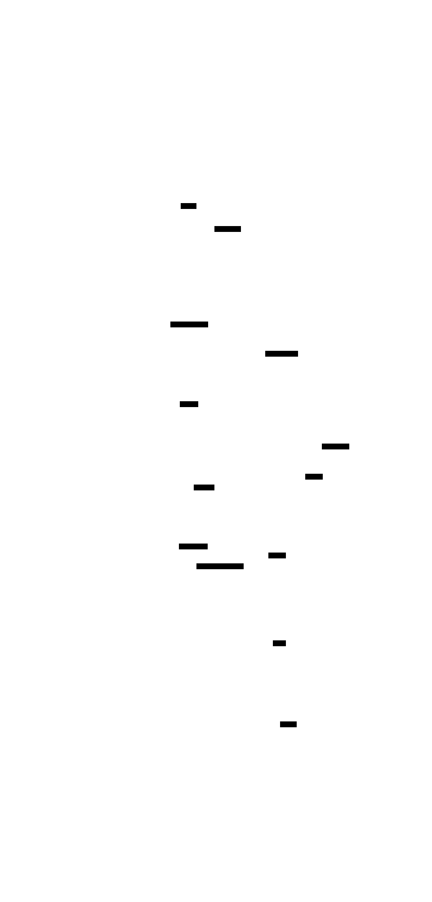

# Workflow Orchestration

## Overview

The orchestration layer is the central nervous system of the platform. It coordinates agent execution, manages shared state, handles failures, and produces the final response. Built on **LangGraph**, it provides graph-based workflow definition with native state management.

## Why LangGraph?

| Capability | Benefit |
|------------|---------|
| Stateful graphs | Agents read/write shared state without direct coupling |
| Conditional edges | Dynamic routing based on agent outputs |
| Checkpointing | Workflow recovery after failures |
| Human-in-the-loop | Interrupt points for approval workflows |
| Streaming | Real-time output delivery to clients |

Alternatives considered: Temporal (overkill for LLM workflows), Celery (no native state), raw async (no graph semantics). See [ADR-001](../adr/adr-001-agent-framework.md).

## Workflow Graph



*Source: [workflow-sequence.d2](../diagrams/workflow-sequence.d2)*

## State Machine


*Source: [workflow-state.d2](../diagrams/workflow-state.d2)*

### State Transitions

| From | To | Trigger |
|------|----|---------|
| PENDING | RUNNING | Workflow execution starts |
| RUNNING | COMPLETED | All agents succeed |
| RUNNING | RETRYING | Transient agent failure |
| RETRYING | RUNNING | Retry attempt initiated |
| RUNNING | FAILED | Max retries exceeded or governance block |
| RETRYING | FAILED | Max retries exceeded |

## Context Passing

Each agent receives a context dictionary built from workflow state:

```python
context = {
    "query": state["query"],
    "shared_memory": state["shared_memory"],
    "research_findings": state["research_findings"],  # if available
    "grounded_response": state["grounded_response"],    # if available
}
```

Agents write outputs back to state via partial updates:

```python
return {
    "research_findings": ResearchFinding(**output.output),
    "agent_outputs": state["agent_outputs"] + [output],
    "total_tokens": state["total_tokens"] + output.tokens_used,
}
```

## Retry Handling

### Retry Policy

```python
max_retries = 3
backoff = exponential(min=1s, max=10s)
retry_on = [TimeoutError, ConnectionError, RateLimitError]
```

### Retry Decision Matrix

| Error Type | Retry? | Fallback |
|-----------|--------|----------|
| Timeout | Yes | Smaller context window |
| Rate limit (429) | Yes | Queue with delay |
| Auth error (401) | No | Alert ops team |
| Invalid response | No | Return partial results |
| Token budget exceeded | No | Truncate and retry once |

### Circuit Breaker

External service calls (OpenAI, Qdrant) are protected by a circuit breaker:

- **Closed**: Normal operation
- **Open**: After 5 consecutive failures, reject calls for 30s
- **Half-open**: Allow one test call to check recovery

## Agent Router

The router selects execution paths before graph compilation:

```python
strategy = router.route(request)
agent_sequence = router.get_agent_sequence(strategy)
graph = build_graph(agent_sequence)  # Dynamic graph per request
```

### Routing Logic


*Source: [workflow-routing.d2](../diagrams/workflow-routing.d2)*

## Failure Recovery

### Graceful Degradation

| Scenario | Recovery |
|----------|----------|
| Research agent fails | Continue with knowledge agent using query only |
| Knowledge agent fails | Summarization uses research findings only |
| Summarization fails | Return raw research + knowledge outputs |
| All agents fail | Return error response with audit trail |

### Checkpointing (Future)

LangGraph checkpointing enables:
- Resume interrupted workflows
- Human-in-the-loop approval gates
- A/B testing with workflow variants
- Time-travel debugging

## Performance Characteristics

| Metric | Target | Current (Mock) |
|--------|--------|----------------|
| End-to-end latency | < 15s | ~100ms |
| Per-agent latency | < 5s | ~30ms |
| Concurrent workflows | 100+ | Limited by single process |
| State size | < 1MB per workflow | ~10KB typical |

## Monitoring Integration

Every workflow execution emits:

- **Trace**: `workflow.execute` span with child spans per agent
- **Metrics**: `agent_workflow_executions_total`, `agent_workflow_latency_seconds`
- **Logs**: Structured JSON with `request_id`, `strategy`, `tokens`, `cost_usd`
- **Audit**: PostgreSQL audit log entry on completion
